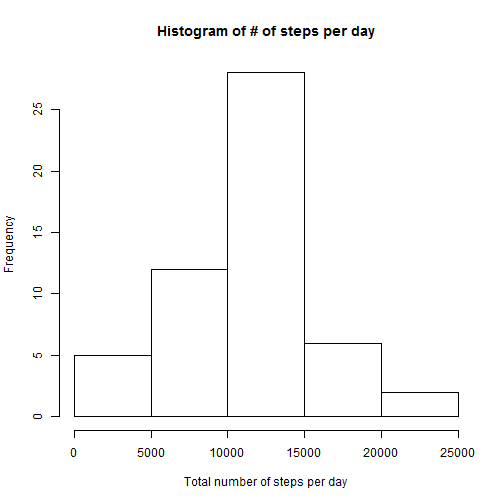
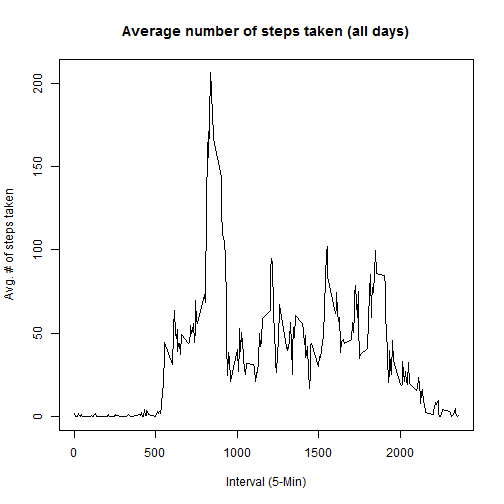
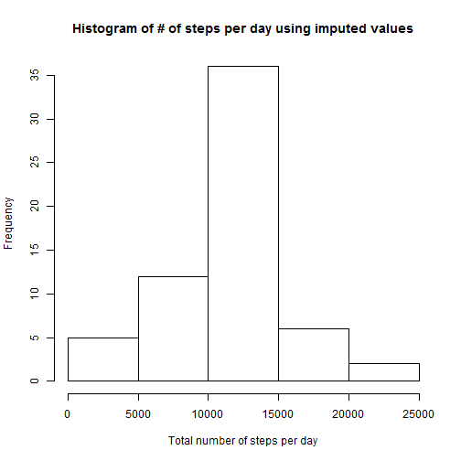

*****************************************
### TITLE: Peer Assessment 1
*****************************************

###Loading and preprocessing the data
In this step, Activity data is loaded and read using "read.csv"


```r
actdata <- data.frame()
actdata <- read.csv("c:\\RR\\activity.csv",header = TRUE)
```

###What is mean and median total number of steps taken per day?
In this step, mean steps taken per day is calculated using the aggragate function. Histogram is plotted for Total number of steps per day and finally, Mean and Median total steps taken per day is reported using Inline Text Computations.


```r
sumstep <- aggregate(steps ~ date, data=actdata, sum)
hist(sumstep$steps, main = "Histogram of # of steps per day", xlab="Total number of steps per day") 
```

 

```r
meansteps <- mean(sumstep$steps)
mediansteps <- median(sumstep$steps)
```

**Mean total number of steps taken per day is 1.0766189 &times; 10<sup>4</sup>.**

**Median total number of steps taken per day is 10765.**

###What is the average daily activity pattern?
In this step, mean steps taken on all days by interval is calculated using the aggragate function. Time-Series Plotted with interval in the x-axis (5-Minute interval, i.e. 5 is 00:05am, 500 is 05:00am, 2355 is 23:55pm). 5-min interval containing the maximum number of steps is determined and reported using Inline Text Computations.


```r
aveint <- aggregate(steps ~ interval, data=actdata, mean)
plot(aveint$interval,aveint$steps,main="Average number of steps taken (all days)",xlab="Interval (5-Min)",ylab="Avg. # of steps taken",type ="l")
```

 

```r
result <- aveint[which.max(aveint$steps),]
MaxInt <- result[ ,1]
Maxsteps <- result[ ,2]
```

**The 5-minute interval that has the maximum # of steps (206.1698113) is 835.**

###Imputing missing values [Assuming "rrconNA" package is installed]
In this step, number of missing value rows are estimated. Missing values are filled using the "rrcovNA" package and impSeq function. [Reference: http://cran.stat.ucla.edu/web/packages/rrcovNA/rrcovNA.pdf, Page 23]. A new activity dataset "actdata_filled" is created with missing values imputed using the impSeq function. Using the "actdata_filled" dataset, Histogram is plotted for Total number of steps per day and finally, Mean and Median total steps taken per day is reported using Inline Text Computations.


```r
misrows <-length(which(is.na(actdata$steps)==T))
library(rrcovNA) ## loading the rrcovNA library
actdata_filled <- data.frame()
actdata_filled <- impSeq(actdata)

sumstep2 <- aggregate(steps ~ date, data=actdata_filled, sum)
hist(sumstep2$steps, main = "Histogram of # of steps per day using imputed values", xlab="Total number of steps per day") 
```

 

```r
meansteps2 <- mean(sumstep2$steps)
mediansteps2 <- median(sumstep2$steps)
```

**The number of missing rows in the activity dataset equals 2304.**

**Using imputed values for "NA", the Mean total number of steps taken per day is 1.0767174 &times; 10<sup>4</sup>.**

**Using imputed values for "NA" the Median total number of steps taken per day is 10765.**

**Using imputed values doesn't change the Median total number of steps taken per day, but does change the Mean slightly because of imputed values replacing "NA" (essentially 0). One wouldn't expect either the Mean or the Median to change significatly because the number of rows with missing values is rather small (2304 out of 17,568 observations**

**Using imputed values does increase slightly, the total number of steps taken per day because imputed values replace "NA" (essentially 0)**


###Are there differences in activity patterns between weekdays and weekends? [Assuming "car" package is installed]
In this steps a new column "day" is added "actdata_filled" dataset. Car package and Recode functions are used to add weekday and weekend variables. [Reference: http://cran.r-project.org/web/packages/car/car.pdf, Page 113].

RAN OUT OF TIME. Below is the work in progress code.. 


```r
##actdata_filled$day <- weekdays(as.Date(actdata$date))

##library(car) ## loading the car libary
##recode(actdata_filled$day, "'Monday'='Weekday'; 'Tuesday'='Weekday'; 'Wednesday'='Weekday'; 'Thursday'='Weekday'; 'Friday'='Weekday'; 'Saturday'='Weekend';'Sunday'='Weekend'")

##aveint2 <- aggregate(steps ~ interval, data=actdata_filled, mean)

##library(lattice)## loading lattice
##xyplot(steps ~ interval |day, data=aveint2,layout =c (1,2))
```


